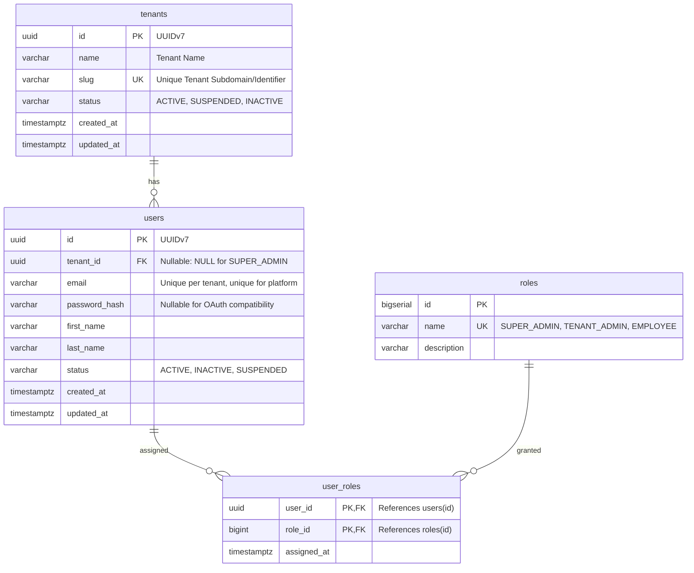

# TexForge — Database Design Specification

## 1. Overview & Core Principles

TexForge uses **PostgreSQL 16** as its primary transactional relational database. The system follows a **shared-database / shared-schema multi-tenant architecture** with strict column-level tenant isolation.

### Architectural Rules
1. **Tenant Scoping**: All tenant-owned domain records incorporate a foreign key reference to `tenants.id`.
2. **Platform vs. Tenant Separation**:
   * Platform administrators (`SUPER_ADMIN`) operate globally with `tenant_id = NULL`.
   * Tenant administrators and staff (`TENANT_ADMIN`, `EMPLOYEE`) are strictly scoped to a single tenant (`tenant_id NOT NULL`).
3. **Time-Ordered Primary Keys**: All business entities (`tenants`, `users`) utilize **UUIDv7-compatible UUIDs** to ensure global uniqueness while preserving monotonic B-tree index locality. Reference data (`roles`) uses `BIGSERIAL`.
4. **OAuth Compatibility**: Local authentication credentials (`password_hash`) are nullable to allow seamless third-party OAuth (Google, SSO) federation without fake passwords.

---

## 2. Entity Relationship Diagram (ERD)



---

## 3. Relational Table Specifications

### 3.1 `tenants` Table

Stores tenant organization records.

| Column | Type | Nullable | Default | Description |
|---|---|---|---|---|
| `id` | `UUID` | **NO** | None | Primary key, generated as UUIDv7 |
| `name` | `VARCHAR(255)` | **NO** | None | Legal or commercial name of the textile mill / enterprise |
| `slug` | `VARCHAR(100)` | **NO** | None | Unique tenant slug (e.g. `acme-textiles`) |
| `status` | `VARCHAR(50)` | **NO** | `'ACTIVE'` | Account status: `ACTIVE`, `SUSPENDED`, `INACTIVE` |
| `created_at` | `TIMESTAMPTZ` | **NO** | `CURRENT_TIMESTAMP` | Audit timestamp |
| `updated_at` | `TIMESTAMPTZ` | **NO** | `CURRENT_TIMESTAMP` | Audit timestamp |

**Indexes & Constraints:**
* `PRIMARY KEY (id)`
* `UNIQUE (slug)`

---

### 3.2 `roles` Table

Stores global authorization roles.

| Column | Type | Nullable | Default | Description |
|---|---|---|---|---|
| `id` | `BIGSERIAL` | **NO** | Auto-increment | Primary key |
| `name` | `VARCHAR(50)` | **NO** | None | Unique role enum name |
| `description` | `VARCHAR(255)` | YES | None | Role description |

**Initial Seed Roles:**
* `SUPER_ADMIN`: Platform-level administrator with global system access (`tenant_id = NULL`).
* `TENANT_ADMIN`: Tenant-level administrator with complete organizational domain access.
* `EMPLOYEE`: Standard tenant employee with operational permissions.

**Indexes & Constraints:**
* `PRIMARY KEY (id)`
* `UNIQUE (name)`

---

### 3.3 `users` Table

Stores user identity records for both platform and tenant users.

| Column | Type | Nullable | Default | Description |
|---|---|---|---|---|
| `id` | `UUID` | **NO** | None | Primary key, generated as UUIDv7 |
| `tenant_id` | `UUID` | **YES** | `NULL` | Foreign key to `tenants(id)`. **`NULL` for `SUPER_ADMIN`**; mandatory for tenant users. |
| `email` | `VARCHAR(255)` | **NO** | None | User email address (normalized lowercase) |
| `password_hash` | `VARCHAR(255)` | **YES** | `NULL` | BCrypt/Argon2 password hash; **`NULL` for OAuth accounts** |
| `first_name` | `VARCHAR(100)` | **NO** | None | Given name |
| `last_name` | `VARCHAR(100)` | YES | None | Family name |
| `status` | `VARCHAR(50)` | **NO** | `'ACTIVE'` | User status: `ACTIVE`, `INACTIVE`, `SUSPENDED` |
| `created_at` | `TIMESTAMPTZ` | **NO** | `CURRENT_TIMESTAMP` | Audit timestamp |
| `updated_at` | `TIMESTAMPTZ` | **NO** | `CURRENT_TIMESTAMP` | Audit timestamp |

**Indexes & Constraints:**
* `PRIMARY KEY (id)`
* `FOREIGN KEY (tenant_id) REFERENCES tenants(id) ON DELETE RESTRICT`
* `CONSTRAINT uq_users_tenant_email UNIQUE(tenant_id, email)`: Guarantees email uniqueness within each tenant, while allowing the same email across distinct organizations.
* `CREATE UNIQUE INDEX uq_platform_user_email ON users(email) WHERE tenant_id IS NULL;`: Partial unique index guaranteeing platform administrators cannot register duplicate emails.
* `CREATE INDEX idx_users_tenant_status ON users(tenant_id, status);`: Composite index for tenant-filtered user status listing.

---

### 3.4 `user_roles` Table

Junction table implementing many-to-many relationship between users and roles.

| Column | Type | Nullable | Default | Description |
|---|---|---|---|---|
| `user_id` | `UUID` | **NO** | None | References `users(id)` |
| `role_id` | `BIGINT` | **NO** | None | References `roles(id)` |
| `assigned_at` | `TIMESTAMPTZ` | **NO** | `CURRENT_TIMESTAMP` | Timestamp role was granted |

**Indexes & Constraints:**
* `PRIMARY KEY (user_id, role_id)`
* `FOREIGN KEY (user_id) REFERENCES users(id) ON DELETE CASCADE`
* `FOREIGN KEY (role_id) REFERENCES roles(id) ON DELETE RESTRICT`
* `CREATE INDEX idx_user_roles_role ON user_roles(role_id);`: Fast lookup of users possessing a specific role.

---

## 4. UUIDv7 vs. UUIDv4 Deep Dive

### The Problem with Random UUIDv4
Random UUIDv4 distributes inserts uniformly across the entire B-tree index address space. When the table index outgrows the PostgreSQL buffer pool (`shared_buffers`):
* Every insert requires a random disk read and write.
* High page split frequency causes up to **50% index bloat**.
* Random write I/O degrades throughput dramatically under heavy insertion loads.

### The Solution: UUIDv7 (RFC 9562)
UUIDv7 encodes a 48-bit millisecond Unix epoch timestamp in its most-significant bits:
```text
 0                   1                   2                   3
 0 1 2 3 4 5 6 7 8 9 0 1 2 3 4 5 6 7 8 9 0 1 2 3 4 5 6 7 8 9 0 1
+-+-+-+-+-+-+-+-+-+-+-+-+-+-+-+-+-+-+-+-+-+-+-+-+-+-+-+-+-+-+-+-+
|                           unix_ts_ms                          |
+-+-+-+-+-+-+-+-+-+-+-+-+-+-+-+-+-+-+-+-+-+-+-+-+-+-+-+-+-+-+-+-+
|          unix_ts_ms           |  ver  |       rand_a          |
+-+-+-+-+-+-+-+-+-+-+-+-+-+-+-+-+-+-+-+-+-+-+-+-+-+-+-+-+-+-+-+-+
|var|                        rand_b                             |
+-+-+-+-+-+-+-+-+-+-+-+-+-+-+-+-+-+-+-+-+-+-+-+-+-+-+-+-+-+-+-+-+
|                            rand_b                             |
+-+-+-+-+-+-+-+-+-+-+-+-+-+-+-+-+-+-+-+-+-+-+-+-+-+-+-+-+-+-+-+-+
```
* **Sequential Locality**: New rows append to the right edge of the B-tree index, keeping hot index pages in RAM cache.
* **Non-Exhaustible & Distributed**: Can be generated on application nodes without roundtrips to database sequences.
* **Privacy & Security**: Retains 74 bits of cryptographically strong randomness, preventing ID enumeration attacks.

---

## 5. OAuth & Extensibility Roadmap

### `password_hash` Nullability
By making `users.password_hash` nullable:
1. Native email/password registrations store the salted hash.
2. Federated OAuth users (e.g. Google Workspace, Microsoft Entra) have `password_hash = NULL`.
3. Accounts can link both password and SSO credentials in future iterations.

### Future `user_oauth_accounts` Table (Planned)
```sql
-- Planned for upcoming OAuth implementation:
-- CREATE TABLE user_oauth_accounts (
--     id BIGSERIAL PRIMARY KEY,
--     user_id UUID NOT NULL REFERENCES users(id) ON DELETE CASCADE,
--     provider VARCHAR(50) NOT NULL, -- 'GOOGLE', 'GITHUB'
--     provider_user_id VARCHAR(255) NOT NULL,
--     created_at TIMESTAMPTZ NOT NULL DEFAULT CURRENT_TIMESTAMP,
--     CONSTRAINT uq_provider_account UNIQUE(provider, provider_user_id)
-- );
```
