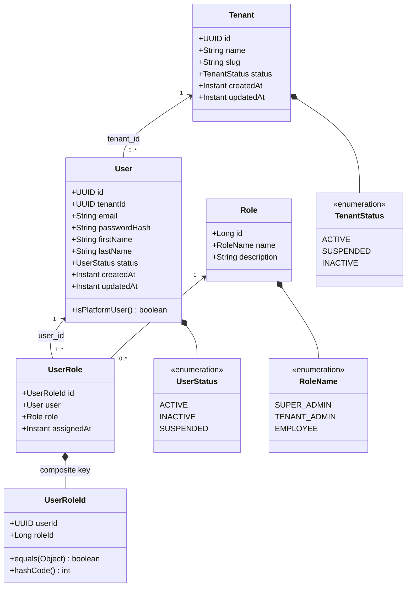

# TexForge — Low-Level Design (LLD): User Management Module

## 1. Module Overview & Package Architecture

The **User Management** module (`com.textile.erp.user`) encapsulates multi-tenancy, platform administration, organizational user identities, and role assignments following the **package-by-feature** architectural pattern.

### Package Layout
```text
com.textile.erp.user
│
├── entity
│   ├── Tenant.java          # Multi-tenant organization aggregate
│   ├── TenantStatus.java    # Enum: ACTIVE, SUSPENDED, INACTIVE
│   ├── User.java            # User identity entity (Platform & Tenant-scoped)
│   ├── UserStatus.java      # Enum: ACTIVE, INACTIVE, SUSPENDED
│   ├── Role.java            # System authorization role
│   ├── RoleName.java        # Enum: SUPER_ADMIN, TENANT_ADMIN, EMPLOYEE
│   ├── UserRole.java        # Composite junction entity
│   └── UserRoleId.java      # Embeddable composite key (userId, roleId)
│
├── repository
│   ├── TenantRepository.java    # Tenant CRUD and slug operations
│   ├── UserRepository.java      # Tenant/Platform scoped email lookups
│   ├── RoleRepository.java      # Role lookup by RoleName
│   └── UserRoleRepository.java  # Junction queries with JOIN FETCH
│
├── dto
│   ├── TenantRequestDto.java    # Tenant creation payload
│   ├── TenantResponseDto.java   # Safe tenant output
│   ├── UserCreateRequestDto.java # User creation payload
│   ├── UserResponseDto.java     # Safe user output with role enum names
│   └── RoleResponseDto.java     # Role metadata output
│
└── service
    ├── TenantService.java       # Tenant service contract
    ├── TenantServiceImpl.java   # Tenant business logic & validation
    ├── UserService.java         # User service contract
    └── UserServiceImpl.java     # Platform/Tenant hierarchy enforcement
```

---

## 2. Class Diagram



---

## 3. Authorization Hierarchy & Invariants

```text
TexForge Platform
│
└── SUPER_ADMIN (tenant_id = NULL)
      │
      ├── Tenant A (UUID-A)
      │    ├── TENANT_ADMIN (tenant_id = UUID-A)
      │    └── EMPLOYEE (tenant_id = UUID-A)
      │
      └── Tenant B (UUID-B)
           ├── TENANT_ADMIN (tenant_id = UUID-B)
           └── EMPLOYEE (tenant_id = UUID-B)
```

### Invariants Enforced in `UserServiceImpl`
1. **Platform Isolation**:
   * If `role == RoleName.SUPER_ADMIN`, `tenantId` MUST be `NULL`. If non-null, rejected with `IllegalArgumentException`.
   * Platform users are checked for uniqueness via `userRepository.existsByEmailAndTenantIdIsNull(email)`.
2. **Tenant Scoping**:
   * If `role != RoleName.SUPER_ADMIN`, `tenantId` MUST NOT be `NULL`.
   * The referenced `tenantId` must exist in `tenants` table (`tenantRepository.existsById(tenantId)`).
   * Email must be unique within that tenant (`userRepository.existsByTenantIdAndEmail(tenantId, email)`).
3. **Role Assignment**:
   * A `SUPER_ADMIN` role cannot be assigned to an existing tenant-scoped user.
   * A tenant role (`TENANT_ADMIN`, `EMPLOYEE`) cannot be assigned to a platform-level user.

---

## 4. DTO & API Boundary Isolation

JPA entities are strictly internal to the persistence and domain layers:
* **No Direct Entity Exposure**: Controllers and API contracts exchange exclusively `*RequestDto` and `*ResponseDto`.
* **Zero Lazy-Loading Leaks**: `UserResponseDto` embeds only detached values (`List<RoleName>`), preventing `LazyInitializationException` outside transactional contexts.
* **Sensitive Field Protection**: `password_hash` is never exposed in response DTOs.
